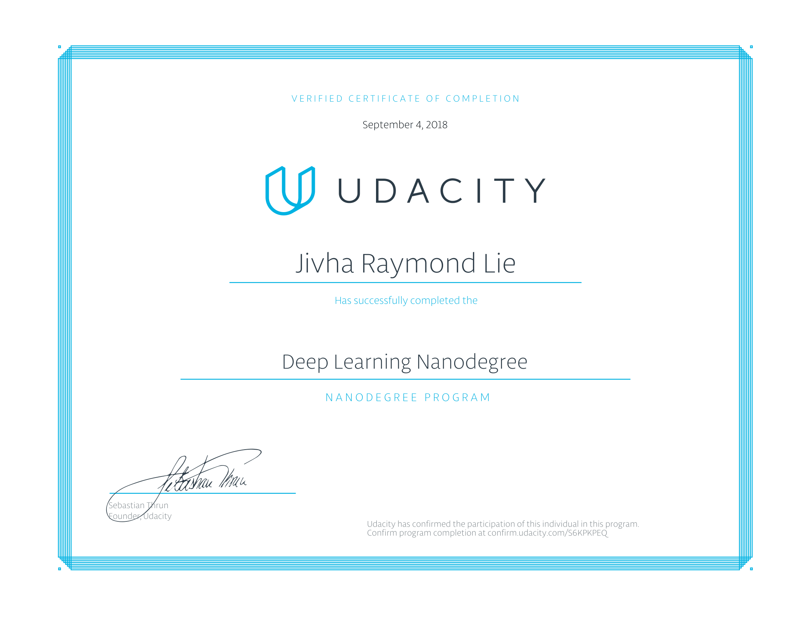

# Teach a Quadcopter How to Fly

---

In this repository you can find my relevant Udacity DLND projects, as results and proof of me being Udacity Deep Learning Nanodegree Foundation Graduate  

---

## Teach Quadcopter How to Fly

### Introduction 
In this project i had to teach agent which is the quadcopter to take off by itself and by no any human interference.  There are four rotors on the quadcopter which its trust powers needs be adjusted in order to fly properly. Instead of hardcoding the quadcopter's motors, i applied Reinforcement Learning of which learning by interactions to the agent. Reinforcement Learning also has many algorithms like, Deep-Q Networks, Monte Carolo, Temporal Diffrence, Policy Gradient, Actor Critic, Deterministic Policy Gradient , and etc.

### Algoritm for the Task
Due to countinous state space and action space, Deep-Q Learning, which heavily relies on discrete action space as outputs is unsuited for the task. Therefore, leaving Policy Gradient, Actor Critic, Deterministic Policy Gradient as options to solve the problem would be the most suitable. However, there is stronger a Algorithms that belived can solve the task more efficently, that is Deep Deterministic Policy Gradient. DDPG combines Deterministic Policy Gradient, Actor Critic, Temporal Difference, and Fixed Target into one set of Algoritm. To "encourge" some explorations to the agent, noises called OU-Noise are added to agent's actions.

### Conclusion

While Algorithm like Deep-Q Learning that outputs discrete action space, DDPG which can outputs both countinous and discrete action space was chosen to be used by the agent to solve the task. DDPG also has been proven able to overcome problems that other Reinforcement Learning can't. After many episodes of training using DDPG, the agent is capable of flying by itself.  
 
---

## Udacity Projects 
<ul>
  <li><a href="https://github.com/vharaymonten/DogBreedsClassificationWithFlask"> Classify 133 Dog Breeds </a></li>
  <li><a href="https://github.com/vharaymonten/TV-Script-Generation-UdacityProject3">Generate TV script using LSTM</a></li>
  <li><a href="https://github.com/vharaymonten/FaceGenerationWithGAN">Generate Human Face with GANs</a></li>
</ul>

---
